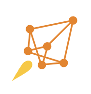

--- 

   

Barely passing as a deep learning engineer, yet passionate about AI Infrastructure, Algorithms, and Finance.

> _Striving to go further in DL, but aiming to be a Quant Dev, as a regular SDE._ 😮‍💨

### Recently Milestone (Monthly)

#### AI

-Transformer%20Reading%20Blog%20for%20Interview%20(2024%2F10%2F27)-black?style=for-the-badge&logoColor=white&labelColor=black&color=%2354C392)

#### Full-Stack

...

### Archived

-React%20%20(2024%2F10%2F27)-black?style=for-the-badge&logoColor=white&labelColor=black&color=D75F28)

### Open Source Contributor

| ⚡️ | Project | ⚡️ | Project | 
| :--: | :--: | :--: | :--: |
|  | `@DMLC/DGL`  |  | `@vLLM-project/vLLM` |
|   | `@Microsoft/DeepSpeed` |  | `@meta-llama/llama` |

<!-- 好久没做开源了 -->

 
<h1 align='center'><i>Work-Life Balance</i></h1> 
